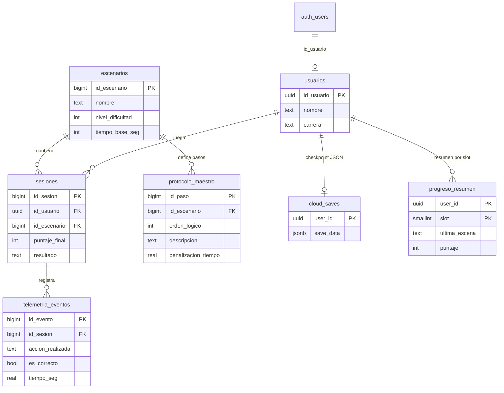

# Parte 4 — Base de datos

## Visión general

Vital Pixel usa **PostgreSQL** en Supabase. El modelo combina:

- **Datos maestros** (escenarios, protocolo) — lectura pública.
- **Datos de jugador** (usuarios, sesiones, telemetría, saves) — protegidos con RLS.
- **Lógica en servidor** (triggers, RPC transaccional) — reglas de negocio y consistencia.

## Diagrama entidad-relación



## Tablas

### `usuarios`

Perfil del jugador, enlazado a `auth.users` de Supabase. Se crea automáticamente al registrarse (trigger `on_auth_user_created`).

### `escenarios`

Niveles/minijuegos. Seeds iniciales:

| id | Nombre | Dificultad | Tiempo base |
|----|--------|------------|-------------|
| 1 | Desmayo - primeros auxilios | 2 | 120 s |
| 2 | RCP | 4 | 90 s |
| 3 | Trivia primeros auxilios | 1 | 180 s |

### `protocolo_maestro`

Pasos correctos por escenario. Las acciones del minijuego en Godot deben coincidir con `descripcion` para que el trigger de puntaje aplique la penalización correcta.

### `sesiones`

Un intento de juego en un escenario. `puntaje_final` inicia en **100** al insertar. `resultado` solo admite `Salvado` o `Fallecido`.

### `telemetria_eventos`

Cada paso del jugador durante una sesión: acción, si fue correcta, tiempo y estado de salud.

### `cloud_saves`

Checkpoint completo de la partida en **JSONB** (posición, misiones, diario, etc.). Una fila por usuario.

### `progreso_resumen`

Vista normalizada extraída del JSON por trigger. Permite consultas SQL sin parsear el blob. Clave compuesta `(user_id, slot)` para hasta 3 slots.

## Row Level Security (RLS)

| Tabla | Política |
|-------|----------|
| `usuarios`, `sesiones`, `cloud_saves`, `progreso_resumen` | Solo el usuario autenticado (`auth.uid()`) |
| `escenarios`, `protocolo_maestro` | SELECT público |
| `telemetria_eventos` | Solo si la sesión pertenece al usuario |

## Triggers y funciones

| Trigger / función | Momento | Efecto |
|-------------------|---------|--------|
| `handle_new_user` | INSERT en `auth.users` | Crea fila en `usuarios` |
| `inicializar_puntaje_sesion_fn` | BEFORE INSERT `sesiones` | `puntaje_final := 100` |
| `validar_puntaje_negativo_fn` | BEFORE UPDATE `sesiones` | Rechaza puntaje &lt; 0 |
| `validar_eventos_al_cerrar_fn` | BEFORE UPDATE `sesiones` | Exige telemetría si hay `resultado` |
| `actualizar_puntaje_final_fn` | AFTER INSERT `telemetria_eventos` | Resta penalización según `protocolo_maestro` |
| `sync_progreso_desde_cloud_save_fn` | AFTER INSERT/UPDATE `cloud_saves` | Upsert en `progreso_resumen` |
| `touch_cloud_save_updated_at_fn` | BEFORE UPDATE `cloud_saves` | Actualiza `updated_at` |

## Transacción: `finalizar_sesion_transaccional`

RPC invocada desde Godot al terminar un minijuego:

```sql
SELECT * FROM finalizar_sesion_transaccional(p_id_sesion, 'Salvado');
```

Valida:

1. `resultado` ∈ {`Salvado`, `Fallecido`}.
2. La sesión tiene al menos un evento de telemetría.
3. Actualiza `resultado`, puntaje y timestamp en una sola operación.

## Vista: `v_dashboard_jugador`

Agrega por sesión: nombre del jugador, escenario, puntaje, resultado, total de acciones y aciertos. Útil para demostraciones en clase.

## Archivos SQL del repositorio

| Archivo | Cuándo usarlo |
|---------|---------------|
| `database_schema.sql` | Proyecto nuevo o reset completo |
| `database_migration_apply.sql` | Actualizar Supabase existente sin borrar datos |
| `database_verification.sql` | Comprobar tablas, triggers, seeds y conteos |

## Demo offline (SQLite)

Para la presentación sin internet, ver [demo_academica/](demo_academica/README.md) — esquema equivalente simplificado y scripts de transacciones.

## Documentos relacionados

- [Parte 5 — Integración Supabase](05-integracion-supabase.md)
- [Parte 8 — Guía de presentación](08-guia-presentacion.md)
