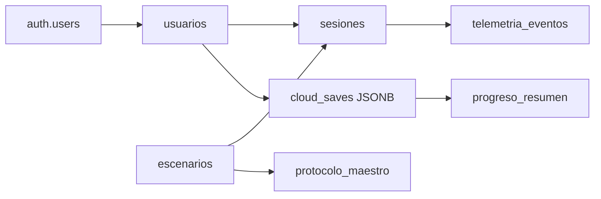

# Guía de exposición — Backend y base de datos

Documento para el compañero que presenta la **capa de datos y Supabase** en Vital Pixel (curso de Bases de Datos Avanzadas).

**Tiempo sugerido:** 8–12 minutos (ajusta según el tiempo total del equipo).

---

## 1. Mensaje principal (di en los primeros 30 segundos)

> *"Vital Pixel es un juego educativo en Godot. Nosotros no guardamos todo en un solo JSON: usamos **PostgreSQL en Supabase** con tablas relacionales, **triggers** que aplican reglas de negocio en el servidor, **transacciones** al cerrar una sesión, y **RLS** para que cada jugador solo vea sus datos. El juego se conecta por **REST API**; la lógica crítica vive en la base de datos, no solo en el cliente."*

---

## 2. Arquitectura en una frase

```text
Godot (cliente)  →  Supabase Auth + PostgREST  →  PostgreSQL
                         ↓
              Triggers, RPC, RLS, vistas
```

| Componente | Qué es | Para qué sirve en el proyecto |
|------------|--------|-------------------------------|
| **Supabase Auth** | Login/registro | Identidad del jugador (`auth.users`) |
| **PostgREST** | API REST sobre tablas | El juego hace `GET/POST/PATCH` sin escribir SQL en GDScript |
| **PostgreSQL** | Motor relacional | Tablas, FK, triggers, transacciones |
| **RLS** | Seguridad por fila | Un alumno no puede leer la partida de otro |
| **RPC** | Función expuesta como endpoint | `finalizar_sesion_transaccional` cierra sesión con validaciones |

**Archivos clave del repo:**

| Archivo | Rol |
|---------|-----|
| `database_schema.sql` | Esquema completo (referencia teórica) |
| `database_migration_apply.sql` | Lo que está desplegado en Supabase |
| `database_verification.sql` | Consultas para comprobar que todo existe |
| `src/singleton/supabase.gd` | Cliente HTTP desde Godot |
| `docs/demo_academica/` | Demos SQLite + scripts PostgreSQL para clase |

---

## 3. Modelo de datos (qué decir tabla por tabla)

### Relaciones (memoriza este flujo)



### Tablas — explicación oral

| Tabla | Qué guarda | Ejemplo real |
|-------|------------|--------------|
| **usuarios** | Perfil del jugador (nombre, carrera) | Se crea solo al registrarse (trigger) |
| **escenarios** | Minijuegos: desmayo, RCP, trivia | 3 filas fijas (datos maestros) |
| **protocolo_maestro** | Pasos correctos y penalización por error | "Llamar al 112" resta 15 puntos en RCP |
| **sesiones** | Un intento de jugar un escenario | Puntaje inicial 100, resultado Salvado/Fallecido |
| **telemetria_eventos** | Cada acción del jugador en esa sesión | "Verificar respiración", correcto/incorrecto, tiempo |
| **cloud_saves** | Partida completa en JSON | Posición, misiones, diario (flexible para el juego) |
| **progreso_resumen** | Resumen normalizado por slot (0–2) | Extraído automáticamente del JSON |

**Idea fuerte para el profesor:** usamos un modelo **híbrido** — JSON para lo que cambia mucho en el juego (`cloud_saves`) y tablas relacionales para lo que hay que **consultar y auditar** (sesiones, telemetría, dashboard).

---

## 4. Cómo se conecta el juego (sin entrar en código GDScript)

### Login y perfil

1. Jugador pulsa **USUARIO** → login con email/contraseña.
2. Supabase devuelve un **token JWT**.
3. Godot guarda el token y envía `Authorization: Bearer …` en cada petición.
4. Se actualiza la fila en **usuarios** (nombre desde el correo).

### Una partida de minijuego (lo más importante de la demo)

```text
1. Abrir minijuego     →  INSERT en sesiones (puntaje = 100)
2. Cada paso del jugador →  INSERT en telemetria_eventos
3. Si el paso es incorrecto →  TRIGGER resta puntos según protocolo_maestro
4. Terminar minijuego  →  RPC finalizar_sesion_transaccional('Salvado' o 'Fallecido')
5. Guardar en nube     →  UPSERT cloud_saves → TRIGGER actualiza progreso_resumen
```

**Frase para la exposición:** *"El cliente solo envía eventos; la base de datos decide el puntaje y valida si se puede cerrar la sesión."*

---

## 5. Triggers (qué demostrar)

| Trigger | Cuándo | Qué hace | Por qué importa |
|---------|--------|----------|-----------------|
| `on_auth_user_created` | Registro | Crea fila en `usuarios` | Integridad Auth ↔ perfil |
| `trg_inicializar_puntaje_sesion` | Nueva sesión | `puntaje_final = 100` | Regla uniforme en servidor |
| `trg_actualizar_puntaje_final` | Telemetría incorrecta | Resta según `protocolo_maestro` | No confiamos en el cliente |
| `trg_validar_eventos_al_cerrar` | Cerrar sesión | Exige ≥1 evento de telemetría | Integridad referencial de negocio |
| `trg_sync_progreso_desde_cloud_save` | Guardar partida | Llena `progreso_resumen` | Normalización parcial del JSON |

### Demo en vivo (Supabase SQL Editor)

Abre `docs/demo_academica/demo_postgres_triggers.sql` y ejecuta el bloque **DEMO 1**:

- Insertas sesión con puntaje 100.
- Insertas telemetría incorrecta `"Llamar al 112"`.
- Muestras que `puntaje_final` bajó (penalización 15, no un -10 fijo).

**Qué decir:** *"La penalización no está hardcodeada en Godot; viene de la tabla protocolo_maestro y el trigger la aplica."*

---

## 6. Transacciones (qué demostrar)

### RPC `finalizar_sesion_transaccional`

Función que el juego llama al terminar un minijuego. En una sola operación:

1. Valida que `resultado` sea `Salvado` o `Fallecido`.
2. Comprueba que exista telemetría.
3. Actualiza la sesión.

Si falla cualquier validación → **ROLLBACK implícito** (excepción, no se guarda un cierre inválido).

### Demo en vivo

Abre `docs/demo_academica/demo_postgres_transacciones.sql`:

- Caso **éxito**: sesión con eventos → RPC devuelve fila actualizada.
- Caso **fallo**: sesión sin eventos → `RAISE EXCEPTION` (no se cierra).

**Qué decir:** *"Equivalente a BEGIN … validaciones … COMMIT, pero encapsulado en una función que el cliente invoca con un solo POST."*

### Equivalencia con SQLite (material del compañero)

| Concepto | SQLite (`demo_sqlite_local/`) | PostgreSQL (Supabase) |
|----------|-------------------------------|------------------------|
| Error en regla | `RAISE(ABORT, …)` | `RAISE EXCEPTION` |
| Transacción manual | `BEGIN; … COMMIT;` / `ROLLBACK;` | RPC + bloques `DO $$ … $$` |
| Tipos | `INTEGER`, `0/1` booleanos | `UUID`, `BOOLEAN`, `JSONB` |
| Seguridad multi-usuario | No (demo local) | **RLS** con `auth.uid()` |

Si no hay internet: usa **DB Browser** con `vital_pixel_demo.db` y `demo_transacciones.sql`.

---

## 7. Seguridad — Row Level Security (RLS)

**Qué decir en 20 segundos:**

> *"Activamos RLS en todas las tablas de jugador. Las políticas usan `auth.uid()` para que cada usuario solo lea y escriba sus sesiones, su telemetría y sus saves. Escenarios y protocolo son solo lectura pública porque son datos maestros del juego."*

No hace falta demo en vivo de RLS salvo que el profesor pregunte; basta mencionar que sin token JWT las peticiones a datos privados fallan.

---

## 8. Vista para el dashboard

```sql
SELECT * FROM v_dashboard_jugador
ORDER BY fecha_hora DESC
LIMIT 10;
```

Muestra por sesión: jugador, escenario, puntaje, resultado, total de acciones y aciertos.

**Ideal después de que alguien juegue un minijuego logueado** en la misma presentación.

---

## 9. Guion minuto a minuto (sugerido)

| Min | Acción |
|-----|--------|
| 0:00 | Contexto: juego + por qué PostgreSQL y no solo archivos locales |
| 1:00 | Diagrama ER / tablas en Supabase Table Editor |
| 2:30 | Flujo: login → sesión → telemetría → cierre |
| 4:00 | **Demo trigger** (penalización por protocolo) |
| 5:30 | **Demo transacción** (RPC con y sin telemetría) |
| 7:00 | Guardado en nube: `cloud_saves` + `progreso_resumen` |
| 8:00 | Vista `v_dashboard_jugador` + consultas de verificación |
| 9:00 | RLS + cierre: SQLite local vs Supabase producción |

---

## 10. Consultas para tener copiadas

```sql
-- ¿Está todo migrado?
SELECT tgname, c.relname AS tabla
FROM pg_trigger t
JOIN pg_class c ON c.oid = t.tgrelid
JOIN pg_namespace n ON n.oid = c.relnamespace
WHERE n.nspname = 'public' AND NOT t.tgisinternal
ORDER BY c.relname, tgname;

-- Protocolo del escenario desmayo
SELECT orden_logico, descripcion, penalizacion_tiempo
FROM protocolo_maestro
WHERE id_escenario = 1
ORDER BY orden_logico;

-- Últimas sesiones
SELECT s.id_sesion, e.nombre, s.puntaje_final, s.resultado, s.fecha_hora
FROM sesiones s
JOIN escenarios e USING (id_escenario)
ORDER BY s.fecha_hora DESC
LIMIT 5;

-- Progreso normalizado
SELECT * FROM progreso_resumen ORDER BY actualizado_en DESC;
```

Más consultas: [`database_verification.sql`](../database_verification.sql).

---

## 11. Preguntas que puede hacer el profesor (y respuestas cortas)

**¿Por qué JSON y tablas a la vez?**  
El JSON permite evolucionar el save del juego sin migrar 20 tablas; `progreso_resumen` extrae lo necesario para reportes SQL.

**¿Quién calcula el puntaje?**  
El servidor, con triggers al insertar telemetría incorrecta. El cliente muestra su propia nota gamificada, pero la sesión en BD sigue las reglas del protocolo.

**¿Qué pasa si el jugador hace trampa con Postman?**  
RLS limita filas a su `user_id`; no puede insertar telemetría en sesiones ajenas. Las reglas de puntaje y cierre están en triggers/RPC, no solo en Godot.

**¿Diferencia con el SQLite del compañero?**  
Mismo modelo conceptual; SQLite es laboratorio offline; Supabase es producción con Auth, UUID, JSONB y RLS.

**¿Cómo se despliega el esquema?**  
`database_migration_apply.sql` en el SQL Editor de Supabase, o `tools/apply_migration.mjs` con `DATABASE_URL` (pooler, puerto 5432).

---

## 12. Checklist antes de exponer

- [ ] Supabase abierto (Table Editor + SQL Editor).
- [ ] Al menos un usuario registrado y una sesión jugada (para que las demos no fallen).
- [ ] `docs/demo_academica/demo_postgres_triggers.sql` probado una vez.
- [ ] `docs/demo_academica/demo_postgres_transacciones.sql` probado una vez.
- [ ] Backup offline: DB Browser + `vital_pixel_demo.db` por si falla internet.
- [ ] No proyectar contraseñas ni `supabase.cfg` en pantalla.

---

## 13. Documentación relacionada

- [Parte 4 — Base de datos](04-base-de-datos.md) — referencia técnica del esquema
- [Parte 5 — Integración Supabase](05-integracion-supabase.md) — detalle cliente Godot
- [Parte 8 — Guía de presentación](08-guia-presentacion.md) — guion general del equipo
- [demo_academica/README.md](demo_academica/README.md) — scripts SQLite y PostgreSQL
